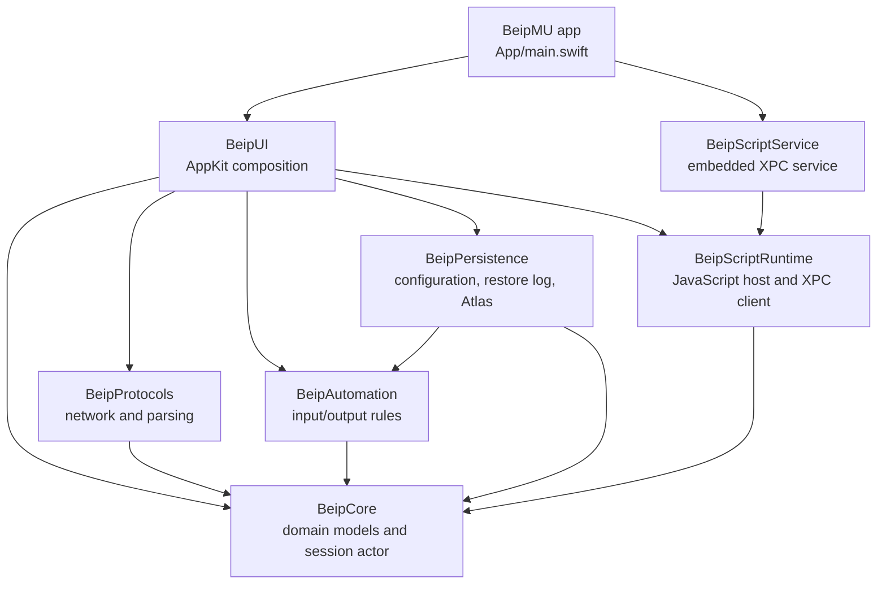
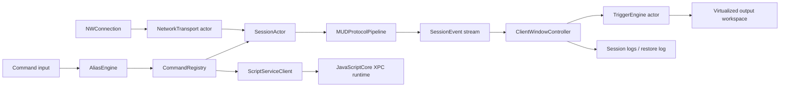

# Architecture

BeipMU separates portable domain behavior from AppKit so protocol,
persistence, automation, and rendering logic can be exercised through Swift
Package Manager tests. The `.app` target is intentionally small and composes
the package modules with an embedded scripting service.

## Module graph

`Package.swift` declares the reusable modules and their tests. `project.yml`
adds the macOS application, the XPC service, and XCUITest bundle around those
modules.

## Runtime data flow

1. `NetworkTransport` owns an `NWConnection`, retry policy, TCP options, and
   optional TLS configuration. It exposes state and byte events as an
   `AsyncStream`.
2. `SessionActor` owns the transport and a `ByteStreamProcessor`. It sequences
   connection state, sent/received byte statistics, idle actions, local echo,
   protocol output, and the session event stream.
3. `MUDProtocolPipeline` performs Telnet negotiation first, decodes negotiated
   text, handles optional MCP and Pueblo state, and finally produces styled
   `RenderedLine` values through the ANSI parser. GMCP and NAWS remain typed
   protocol events.
4. `ClientWindowController` composes the session with scoped automation,
   scripting, profile state, logs, media, WebViews, maps, and AppKit views.
5. `OutputHistory`, `LineLayoutIndex`, and `VirtualizedOutputView` keep retained
   history bounded while limiting layout and painting to viewport candidates.

## Persistence model

`LegacyConfigurationDocument` parses the v331 text format without discarding
comments, ordering, quoting choices, or unknown fields.
`LegacyConfigurationProjection` turns supported fields into typed worlds,
characters, puppets, automation groups, connection policy, logging, scripting,
and workspace settings. `LegacyConfigurationWorkspace` edits that projection
by applying narrow changes to the original document and then reparsing it.

The UI's `ProfileLibrary` owns the current workspace and uses revision checks
to prevent a stale editor from overwriting newer changes. Writes are atomic;
the previous live `Config.txt` is copied to `Config.backup.txt` before a new
version replaces it. Mac-only state is stored separately in `Config.mac.json`
so the portable configuration remains compatible.

Restore logs use a bounded binary record format with repair and playback
support. Atlas maps are ZIP/XML archives whose reader and writer preserve
unknown compatible content for round trips.

## Automation pipeline

Automation is resolved at global, world, character, and puppet scopes.

- `AliasEngine` matches outgoing input, expands captures and variables, and
  reports trace events for the debugger.
- `CommandRegistry` parses slash commands into typed `CommandOutcome` values;
  the window controller performs the corresponding UI or session operation.
- `TriggerEngine` is an actor because it owns multiline match state, mutable
  statistics, and time-sensitive effects across received lines.
- `DelayScheduler` owns delayed and repeating command tasks.
- `KeyboardMacroEngine` normalizes AppKit-independent key definitions before
  the UI binds them to actual events.

Typed outcomes and effects keep engines testable and prevent the domain
modules from depending on AppKit.

## Scripting boundary

`BeipScriptRuntime` defines the JavaScript host snapshot, output operations,
and the XPC protocol. The application sends immutable snapshots to
`BeipScriptService`; the service evaluates JavaScriptCore code and returns a
value, error, and ordered list of operations for the app to replay.

Each XPC connection receives its own `ScriptRuntime`. When a request exceeds
the three-second watchdog or the user resets scripting, the client invalidates
that connection. The next evaluation gets a new runtime rather than waiting
behind a stuck JavaScript execution.

The XPC boundary improves recoverability, but scripts are still trusted
automation rather than a security sandbox. The project currently disables the
hardened runtime for both application targets.

## Test strategy

The Swift package tests domain and UI components without launching the full
application. `BeipTestSupport` supplies a scripted local MU server for network
and service resilience tests. Deterministic fixtures exercise large profiles,
many concurrent sessions, restore logs, and Atlas round trips.

XCUITests cover complete application flows and compare named screenshots with
checked-in baselines. Separate workspace and full-app soak scripts enforce
throughput, retained-history, viewport-candidate, resident-memory, and leak
budgets. See [DEVELOPMENT.md](DEVELOPMENT.md) for exact commands.
